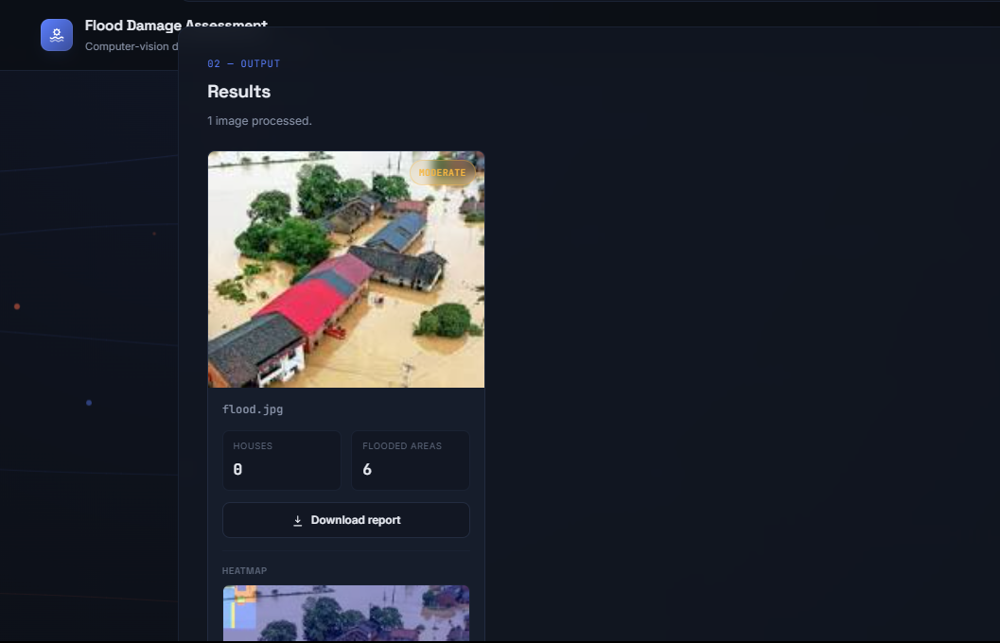
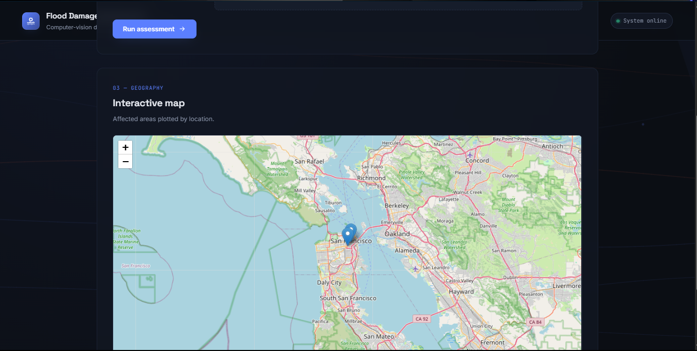

# Flood Damage Assessment System

A computer-vision tool that scans uploaded imagery for flood damage — detecting structures, mapping flooded regions, scoring severity, and plotting affected areas on an interactive map.

---

## Dashboard

Upload a single image or a batch, and run the assessment from one screen.

- **Single or multiple image upload** — switch modes depending on whether you're assessing one site or a batch
- **Drag-and-drop intake** — drop files directly or browse manually
- **One-click analysis** — kicks off detection as soon as imagery is submitted

---

## Results

Each processed image returns a structured breakdown: detected houses, flooded areas, an auto-generated severity rating, and a heatmap overlay.

- **Per-image detection counts** — houses and flooded areas identified by the model
- **Severity rating** — color-coded (low / moderate / high) for fast triage
- **Heatmap overlay** — visualizes flood concentration across the image
- **Downloadable report** — export a PDF summary per image

---

## Interactive Map

Every assessed location is plotted geographically, so affected areas can be reviewed at a glance.

- **Geolocated markers** for each affected area
- **Pan and zoom** to inspect specific regions
- **Popup details** on marker click

---

## Tech Stack

- **Backend:** Flask (Python)
- **Detection model:** YOLO
- **Frontend:** HTML, CSS, vanilla JS
- **Mapping:** Leaflet (via Folium)
